```mermaid
flowchart TB
    subgraph current["FindWords.Benchmarks.csproj"]
        MAIN["<b>📦&nbsp;FindWords.Benchmarks.csproj</b><br/><small>net8.0</small>"]
        click MAIN "#findwordsbenchmarksfindwordsbenchmarkscsproj"
    end
    subgraph downstream["Dependencies (2"]
        P3["<b>📦&nbsp;FindWords.Test.csproj</b><br/><small>net8.0</small>"]
        P2["<b>📦&nbsp;FindWords.Shared.csproj</b><br/><small>net8.0</small>"]
        click P3 "#findwordstestfindwordstestcsproj"
        click P2 "#findwordssharedfindwordssharedcsproj"
    end
    MAIN --> P3
    MAIN --> P2

```

```mermaid
flowchart TB
    subgraph current["FindWords.Console.csproj"]
        MAIN["<b>📦&nbsp;FindWords.Console.csproj</b><br/><small>net8.0</small>"]
        click MAIN "#findwordsconsolefindwordsconsolecsproj"
    end
    subgraph downstream["Dependencies (1"]
        P2["<b>📦&nbsp;FindWords.Shared.csproj</b><br/><small>net8.0</small>"]
        click P2 "#findwordssharedfindwordssharedcsproj"
    end
    MAIN --> P2

```

```mermaid
flowchart TB
    subgraph upstream["Dependants (4)"]
        P1["<b>📦&nbsp;FindWords.Web.csproj</b><br/><small>net8.0</small>"]
        P3["<b>📦&nbsp;FindWords.Test.csproj</b><br/><small>net8.0</small>"]
        P4["<b>📦&nbsp;FindWords.Console.csproj</b><br/><small>net8.0</small>"]
        P5["<b>📦&nbsp;FindWords.Benchmarks.csproj</b><br/><small>net8.0</small>"]
        click P1 "#findwordswebfindwordswebcsproj"
        click P3 "#findwordstestfindwordstestcsproj"
        click P4 "#findwordsconsolefindwordsconsolecsproj"
        click P5 "#findwordsbenchmarksfindwordsbenchmarkscsproj"
    end
    subgraph current["FindWords.Shared.csproj"]
        MAIN["<b>📦&nbsp;FindWords.Shared.csproj</b><br/><small>net8.0</small>"]
        click MAIN "#findwordssharedfindwordssharedcsproj"
    end
    P1 --> MAIN
    P3 --> MAIN
    P4 --> MAIN
    P5 --> MAIN

```

```mermaid
flowchart TB
    subgraph upstream["Dependants (1)"]
        P5["<b>📦&nbsp;FindWords.Benchmarks.csproj</b><br/><small>net8.0</small>"]
        click P5 "#findwordsbenchmarksfindwordsbenchmarkscsproj"
    end
    subgraph current["FindWords.Test.csproj"]
        MAIN["<b>📦&nbsp;FindWords.Test.csproj</b><br/><small>net8.0</small>"]
        click MAIN "#findwordstestfindwordstestcsproj"
    end
    subgraph downstream["Dependencies (2"]
        P1["<b>📦&nbsp;FindWords.Web.csproj</b><br/><small>net8.0</small>"]
        P2["<b>📦&nbsp;FindWords.Shared.csproj</b><br/><small>net8.0</small>"]
        click P1 "#findwordswebfindwordswebcsproj"
        click P2 "#findwordssharedfindwordssharedcsproj"
    end
    P5 --> MAIN
    MAIN --> P1
    MAIN --> P2

```

```mermaid
flowchart TB
    subgraph upstream["Dependants (1)"]
        P3["<b>📦&nbsp;FindWords.Test.csproj</b><br/><small>net8.0</small>"]
        click P3 "#findwordstestfindwordstestcsproj"
    end
    subgraph current["FindWords.Web.csproj"]
        MAIN["<b>📦&nbsp;FindWords.Web.csproj</b><br/><small>net8.0</small>"]
        click MAIN "#findwordswebfindwordswebcsproj"
    end
    subgraph downstream["Dependencies (1"]
        P2["<b>📦&nbsp;FindWords.Shared.csproj</b><br/><small>net8.0</small>"]
        click P2 "#findwordssharedfindwordssharedcsproj"
    end
    P3 --> MAIN
    MAIN --> P2

```

# Projects and dependencies analysis

This document provides a comprehensive overview of the projects and their dependencies in the context of upgrading to .NETCoreApp,Version=v10.0.

## Table of Contents

- [Executive Summary](#executive-Summary)
  - [Highlevel Metrics](#highlevel-metrics)
  - [Projects Compatibility](#projects-compatibility)
  - [Package Compatibility](#package-compatibility)
  - [API Compatibility](#api-compatibility)
- [Aggregate NuGet packages details](#aggregate-nuget-packages-details)
- [Top API Migration Challenges](#top-api-migration-challenges)
  - [Technologies and Features](#technologies-and-features)
  - [Most Frequent API Issues](#most-frequent-api-issues)
- [Projects Relationship Graph](#projects-relationship-graph)
- [Project Details](#project-details)

  - [FindWords.Benchmarks\FindWords.Benchmarks.csproj](#findwordsbenchmarksfindwordsbenchmarkscsproj)
  - [FindWords.Console\FindWords.Console.csproj](#findwordsconsolefindwordsconsolecsproj)
  - [FindWords.Shared\FindWords.Shared.csproj](#findwordssharedfindwordssharedcsproj)
  - [FindWords.Test\FindWords.Test.csproj](#findwordstestfindwordstestcsproj)
  - [FindWords.Web\FindWords.Web.csproj](#findwordswebfindwordswebcsproj)

## Executive Summary

### Highlevel Metrics

| Metric | Count | Status |
| :--- | :---: | :--- |
| Total Projects | 5 | All require upgrade |
| Total NuGet Packages | 6 | All compatible |
| Total Code Files | 29 |  |
| Total Code Files with Incidents | 6 |  |
| Total Lines of Code | 1099 |  |
| Total Number of Issues | 6 |  |
| Estimated LOC to modify | 1+ | at least 0.1% of codebase |

### Projects Compatibility

| Project | Target Framework | Difficulty | Package Issues | API Issues | Est. LOC Impact | Description |
| :--- | :---: | :---: | :---: | :---: | :---: | :--- |
| [FindWords.Benchmarks\FindWords.Benchmarks.csproj](#findwordsbenchmarksfindwordsbenchmarkscsproj) | net8.0 | 🟢 Low | 0 | 0 |  | DotNetCoreApp, Sdk Style = True |
| [FindWords.Console\FindWords.Console.csproj](#findwordsconsolefindwordsconsolecsproj) | net8.0 | 🟢 Low | 0 | 0 |  | DotNetCoreApp, Sdk Style = True |
| [FindWords.Shared\FindWords.Shared.csproj](#findwordssharedfindwordssharedcsproj) | net8.0 | 🟢 Low | 0 | 0 |  | ClassLibrary, Sdk Style = True |
| [FindWords.Test\FindWords.Test.csproj](#findwordstestfindwordstestcsproj) | net8.0 | 🟢 Low | 0 | 0 |  | DotNetCoreApp, Sdk Style = True |
| [FindWords.Web\FindWords.Web.csproj](#findwordswebfindwordswebcsproj) | net8.0 | 🟢 Low | 0 | 1 | 1+ | AspNetCore, Sdk Style = True |

### Package Compatibility

| Status | Count | Percentage |
| :--- | :---: | :---: |
| ✅ Compatible | 6 | 100.0% |
| ⚠️ Incompatible | 0 | 0.0% |
| 🔄 Upgrade Recommended | 0 | 0.0% |
| ***Total NuGet Packages*** | ***6*** | ***100%*** |

### API Compatibility

| Category | Count | Impact |
| :--- | :---: | :--- |
| 🔴 Binary Incompatible | 0 | High - Require code changes |
| 🟡 Source Incompatible | 0 | Medium - Needs re-compilation and potential conflicting API error fixing |
| 🔵 Behavioral change | 1 | Low - Behavioral changes that may require testing at runtime |
| ✅ Compatible | 2024 |  |
| ***Total APIs Analyzed*** | ***2025*** |  |

## Aggregate NuGet packages details

| Package | Current Version | Suggested Version | Projects | Description |
| :--- | :---: | :---: | :--- | :--- |
| BenchmarkDotNet | 0.13.12 |  | [FindWords.Benchmarks.csproj](#findwordsbenchmarksfindwordsbenchmarkscsproj) | ✅Compatible |
| coverlet.collector | 6.0.2 |  | [FindWords.Test.csproj](#findwordstestfindwordstestcsproj) | ✅Compatible |
| Microsoft.Azure.SignalR | 1.26.0 |  | [FindWords.Web.csproj](#findwordswebfindwordswebcsproj) | ✅Compatible |
| Microsoft.NET.Test.Sdk | 17.11.0-release-24373-02 |  | [FindWords.Test.csproj](#findwordstestfindwordstestcsproj) | ✅Compatible |
| xunit | 2.9.0 |  | [FindWords.Test.csproj](#findwordstestfindwordstestcsproj) | ✅Compatible |
| xunit.runner.visualstudio | 3.0.0-pre.20 |  | [FindWords.Test.csproj](#findwordstestfindwordstestcsproj) | ✅Compatible |

## Top API Migration Challenges

### Technologies and Features

| Technology | Issues | Percentage | Migration Path |
| :--- | :---: | :---: | :--- |

### Most Frequent API Issues

| API | Count | Percentage | Category |
| :--- | :---: | :---: | :--- |
| M:Microsoft.AspNetCore.Builder.ExceptionHandlerExtensions.UseExceptionHandler(Microsoft.AspNetCore.Builder.IApplicationBuilder,System.String) | 1 | 100.0% | Behavioral Change |

## Projects Relationship Graph

Legend:
📦 SDK-style project
⚙️ Classic project

```mermaid
flowchart LR
    P1["<b>📦&nbsp;FindWords.Web.csproj</b><br/><small>net8.0</small>"]
    P2["<b>📦&nbsp;FindWords.Shared.csproj</b><br/><small>net8.0</small>"]
    P3["<b>📦&nbsp;FindWords.Test.csproj</b><br/><small>net8.0</small>"]
    P4["<b>📦&nbsp;FindWords.Console.csproj</b><br/><small>net8.0</small>"]
    P5["<b>📦&nbsp;FindWords.Benchmarks.csproj</b><br/><small>net8.0</small>"]
    P1 --> P2
    P3 --> P1
    P3 --> P2
    P4 --> P2
    P5 --> P3
    P5 --> P2
    click P1 "#findwordswebfindwordswebcsproj"
    click P2 "#findwordssharedfindwordssharedcsproj"
    click P3 "#findwordstestfindwordstestcsproj"
    click P4 "#findwordsconsolefindwordsconsolecsproj"
    click P5 "#findwordsbenchmarksfindwordsbenchmarkscsproj"

```

## Project Details

### FindWords.Benchmarks\FindWords.Benchmarks.csproj

#### Project Info

- **Current Target Framework:** net8.0
- **Proposed Target Framework:** net10.0
- **SDK-style**: True
- **Project Kind:** DotNetCoreApp
- **Dependencies**: 2
- **Dependants**: 0
- **Number of Files**: 2
- **Number of Files with Incidents**: 1
- **Lines of Code**: 81
- **Estimated LOC to modify**: 0+ (at least 0.0% of the project)

#### Dependency Graph

Legend:
📦 SDK-style project
⚙️ Classic project

### API Compatibility

| Category | Count | Impact |
| :--- | :---: | :--- |
| 🔴 Binary Incompatible | 0 | High - Require code changes |
| 🟡 Source Incompatible | 0 | Medium - Needs re-compilation and potential conflicting API error fixing |
| 🔵 Behavioral change | 0 | Low - Behavioral changes that may require testing at runtime |
| ✅ Compatible | 54 |  |
| ***Total APIs Analyzed*** | ***54*** |  |

### FindWords.Console\FindWords.Console.csproj

#### Project Info

- **Current Target Framework:** net8.0
- **Proposed Target Framework:** net10.0
- **SDK-style**: True
- **Project Kind:** DotNetCoreApp
- **Dependencies**: 1
- **Dependants**: 0
- **Number of Files**: 1
- **Number of Files with Incidents**: 1
- **Lines of Code**: 28
- **Estimated LOC to modify**: 0+ (at least 0.0% of the project)

#### Dependency Graph

Legend:
📦 SDK-style project
⚙️ Classic project

### API Compatibility

| Category | Count | Impact |
| :--- | :---: | :--- |
| 🔴 Binary Incompatible | 0 | High - Require code changes |
| 🟡 Source Incompatible | 0 | Medium - Needs re-compilation and potential conflicting API error fixing |
| 🔵 Behavioral change | 0 | Low - Behavioral changes that may require testing at runtime |
| ✅ Compatible | 30 |  |
| ***Total APIs Analyzed*** | ***30*** |  |

### FindWords.Shared\FindWords.Shared.csproj

#### Project Info

- **Current Target Framework:** net8.0
- **Proposed Target Framework:** net10.0
- **SDK-style**: True
- **Project Kind:** ClassLibrary
- **Dependencies**: 0
- **Dependants**: 4
- **Number of Files**: 16
- **Number of Files with Incidents**: 1
- **Lines of Code**: 494
- **Estimated LOC to modify**: 0+ (at least 0.0% of the project)

#### Dependency Graph

Legend:
📦 SDK-style project
⚙️ Classic project

### API Compatibility

| Category | Count | Impact |
| :--- | :---: | :--- |
| 🔴 Binary Incompatible | 0 | High - Require code changes |
| 🟡 Source Incompatible | 0 | Medium - Needs re-compilation and potential conflicting API error fixing |
| 🔵 Behavioral change | 0 | Low - Behavioral changes that may require testing at runtime |
| ✅ Compatible | 470 |  |
| ***Total APIs Analyzed*** | ***470*** |  |

### FindWords.Test\FindWords.Test.csproj

#### Project Info

- **Current Target Framework:** net8.0
- **Proposed Target Framework:** net10.0
- **SDK-style**: True
- **Project Kind:** DotNetCoreApp
- **Dependencies**: 2
- **Dependants**: 1
- **Number of Files**: 12
- **Number of Files with Incidents**: 1
- **Lines of Code**: 337
- **Estimated LOC to modify**: 0+ (at least 0.0% of the project)

#### Dependency Graph

Legend:
📦 SDK-style project
⚙️ Classic project

### API Compatibility

| Category | Count | Impact |
| :--- | :---: | :--- |
| 🔴 Binary Incompatible | 0 | High - Require code changes |
| 🟡 Source Incompatible | 0 | Medium - Needs re-compilation and potential conflicting API error fixing |
| 🔵 Behavioral change | 0 | Low - Behavioral changes that may require testing at runtime |
| ✅ Compatible | 272 |  |
| ***Total APIs Analyzed*** | ***272*** |  |

### FindWords.Web\FindWords.Web.csproj

#### Project Info

- **Current Target Framework:** net8.0
- **Proposed Target Framework:** net10.0
- **SDK-style**: True
- **Project Kind:** AspNetCore
- **Dependencies**: 1
- **Dependants**: 1
- **Number of Files**: 32
- **Number of Files with Incidents**: 2
- **Lines of Code**: 159
- **Estimated LOC to modify**: 1+ (at least 0.6% of the project)

#### Dependency Graph

Legend:
📦 SDK-style project
⚙️ Classic project

### API Compatibility

| Category | Count | Impact |
| :--- | :---: | :--- |
| 🔴 Binary Incompatible | 0 | High - Require code changes |
| 🟡 Source Incompatible | 0 | Medium - Needs re-compilation and potential conflicting API error fixing |
| 🔵 Behavioral change | 1 | Low - Behavioral changes that may require testing at runtime |
| ✅ Compatible | 1198 |  |
| ***Total APIs Analyzed*** | ***1199*** |  |

